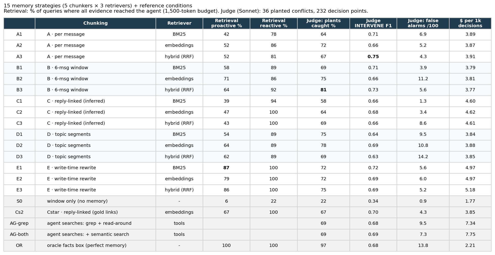
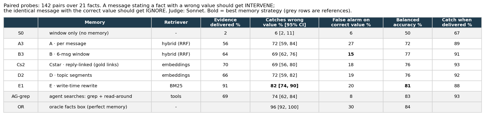

# proactive-memory-bench

I wanted to know one thing: if an AI teammate is sitting in your team's chat, will it notice on its own when
someone says something that contradicts what was said earlier? And does it matter how the agent stores the
chat history?

The case I kept coming back to is what I call the "I did" problem. Someone asks "who can take AND-341?" and
the answer is just "I'll take it", or a 👍. That reply shares no words with the question, so if your memory
stores messages one at a time, you lose who took what. A week later someone asks again, and the agent has no idea.

This is a one-week project and it's pretty rough. I'm sharing it to start a conversation, not as a finished
benchmark. The full write-up of results is in [`results/findings.md`](results/findings.md), and my notes on
what I'd change next are in [`notes/real_data_lessons.md`](notes/real_data_lessons.md).

> **Heads up: every chat in this repo is made up.** The four workspaces (`ando`, `anthropic`, `openai`, `xai`)
> were written by a language model. I used real company names and some first names just to make the setting
> feel familiar, but every event, number, date, deal, person and message is invented. None of it describes a
> real company, team or conversation, and this isn't affiliated with or endorsed by any of them. There's also a
> small check on real chat data near the end; that data is private and not in this repo, only aggregate numbers.

## What I built

Four fake Slack-style workspaces, about 880 messages in total, with threads, side conversations happening in the
middle of other conversations, and emoji reactions. Inside them I planted 36 conflicts the agent should catch:
someone quoting a date that already moved, re-asking a question that was answered days ago, a deadline that
passed with nothing done, and so on. I also added decoys that look like conflicts but aren't, plus a lot of
ordinary chatter. That gives 303 points where the agent has to decide: speak up (INTERVENE), make a note to
check later (TRACK), or stay quiet (IGNORE).

The decision maker is a fixed judge (Claude Sonnet with the same prompt and rubric every time). The only thing
that changes is what it remembers. I tried 15 memory setups: 5 ways of cutting the chat into chunks, crossed
with 3 ways of searching them.

- **A, per message:** one chunk per message.
- **B, windows:** 6 messages in a row.
- **C, reply-linked:** a message plus what it's replying to (links guessed by Haiku; "Cstar" uses the true links as a ceiling).
- **D, topic segments:** an LLM splits each channel into topics.
- **E, rewrite:** every message gets rewritten into a standalone sentence when it's saved ("AJ took ownership of AND-341").

Searches: BM25 (keyword), embeddings (meaning), and a hybrid of the two. For comparison I also ran no memory at
all, two agents that search the history themselves with grep-style tools, and an "oracle" that's just handed a
perfect list of the current facts.

I looked at three things: did the evidence actually reach the agent, could it answer a direct question from
what it got, and did the judge speak up at the right moment.

## Results



"Proactive" retrieval means the agent searches with the latest messages, without being asked anything, which is
the real situation. "Reactive" means it's asked the question directly. "Plants caught" is the share of the 36
planted conflicts where the judge spoke up at the conflict or within the next two messages. False alarms are
per 100 decisions. Markdown version: [`results/strategy_table.md`](results/strategy_table.md).

Because 36 conflicts turned out to be too few to tell the setups apart, I also made 142 pairs of test messages:
one that states a fact with the wrong value, and the exact same message with the right value. The judge should
speak up on the first and stay quiet on the second.



Markdown version: [`results/probe_table.md`](results/probe_table.md).

### What I found

1. **How you chunk the chat matters a lot more than how you search it.** Getting the right evidence to the agent
   varies by about 41 points across chunking methods and only about 7 across search methods. That held up when I
   swapped in a different embedding model and when I resampled the data. Storing one message per chunk gets
   plain statements through 84% of the time, but "I'll take it"-style answers only 18%.
2. **If the evidence gets through, the agent can use it.** Asked a direct question, it answered correctly 93% of
   the time when the evidence was retrieved and 3% when it wasn't.
3. **On the 36 planted conflicts, I can't rank the setups.** They all land between 58% and 81%, the error bars
   are about ±15 points, and just rerunning the same judge moved some numbers by 8. Any memory is way better than
   none (22%), and the perfect-facts oracle gets 97%.
4. **On the paired test messages, more evidence does mean more catches.** The rewrite setup catches 82% of wrong
   values versus 69% for windows. Fair warning: I designed this test after seeing result 3, and it only covers one
   kind of conflict.
5. **Missed deadlines are basically invisible to search.** Nothing in the chat says "this didn't happen", so
   there's nothing to retrieve. Retrieval setups caught 0-43% of these; a simple list of open to-dos caught all of
   them, but only when it wasn't buried under a pile of retrieved messages.
6. **More memory makes the agent chattier, not smarter.** The oracle had the most false alarms. The grep agent,
   which only searches when something looks worth checking, had the fewest.
7. **The judge model matters as much as the memory.** Swapping Sonnet for Haiku dropped catches by 5-22 points,
   doubled or tripled false alarms, and shuffled the ranking.

### A check on real chat

I also ran the same judge on 50 moments from a real team chat where people and AI agents work together (private
data, not included). It never spoke up once, under any model. Two labelers each flagged 5 moments as worth
interrupting, but only agreed on 2, and both of those were about the agents' own work: duplicate tickets from
agents answering in parallel, and an agent contradicting its own earlier diagnosis. My benchmark doesn't simulate
that kind of conflict at all, which is probably the most useful thing this whole exercise showed me. Numbers are
in [`results/real_check.md`](results/real_check.md), and ideas for a v2 are in
[`notes/real_data_lessons.md`](notes/real_data_lessons.md).

## Caveats

- It's all simulated, written by one model family, and judged by the same family.
- 36 planted conflicts is small. Most differences between memory setups at the decision level are within noise.
- The conflicts are people changing facts. Agents making mistakes, and facts that live in tools (tickets,
  deploys), aren't modeled.
- Labels come from me plus a GPT labeler, checked against each other (see
  [`results/human_agreement.md`](results/human_agreement.md)).
- The whole thing cost about $80 in API calls.

## Running it

```bash
uv sync
# Scoring and tables from the committed runs (no API keys needed):
uv run python -m eval.score            # results/main.csv, by_slice.csv, grid_stats.csv
uv run python -m eval.attribute        # why each plant was missed
uv run python -m eval.score_probes     # paired-probe decisions
uv run python -m eval.robustness       # second judge, second embedding model, rerun noise
uv run python -m eval.make_tables      # the tables and figure above
```

Regenerating anything with a model needs `ANTHROPIC_API_KEY` and `OPENAI_API_KEY` in `.env`
(`SIM_MODEL`, `JUDGE_MODEL`, `CHEAP_JUDGE_MODEL`, `LABELER_MODEL`). In order: `sim.run_workspace` (generate
chats) → `world.verify` → `eval.select_points` → labeling (`label/`) → memory builds (`memory.linker`,
`memory.segment`, `memory.rewrite`) → `eval.retrieval_grid` and `eval.reader` → `judge.batch` / `judge.run` →
the scoring commands above. LLM responses are cached under `data/cache/` (not committed).

## What's where

```
world/      fictional workspace ledgers (facts, plants, personas) + verify / stats / restatement audit
sim/        chat simulator and LLM client (disk-cached)
memory/     chunkers A-E, reply linker, topic segmenter, rewriter, retrievers, grep agent tools
probes/     probe triggers and paired conflict/control probes
judge/      fixed judge prompt, memory conditions, live and batch runners
label/      labeling sheets, LLM labeler, agreement and adjudication
eval/       decision-point selection, retrieval grid, reader, scoring, attribution, robustness, tables
data/       generated workspaces, decision points, gold labels, every judge run (data/real/ is private, ignored)
results/    all result tables, findings, figures
notes/      design notes and lessons for a next version
```
git add README.md eval/make_tables.py results/figs/strategy_table.png results/figs/probe_table.png results/*.md .gitignore
git commit -m "README: tables as images, drop duplicate markdown table"
git push


