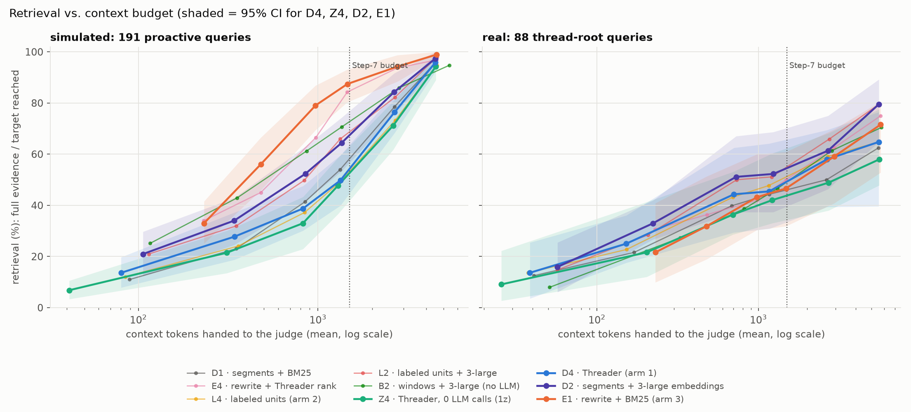
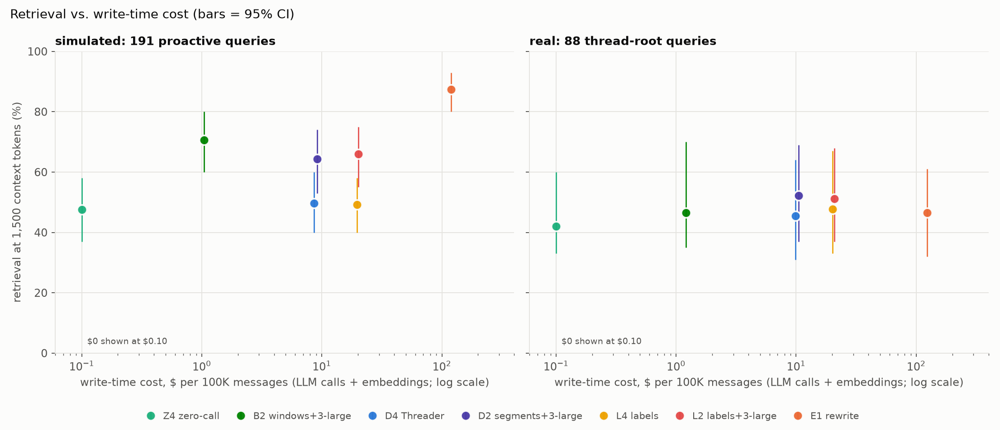

# Three-way memory comparison: Threader vs. conversational units vs. memory rewrite

All simulated workspaces, people and companies are fictional (see the disclaimer in the README). The real-data
check uses a private team chat (`data/real/`, git-ignored): only aggregate numbers appear here, and every quoted
example comes from the simulated workspaces. Numbers come from `results/threeway_*.csv` and
`results/threeway_cost.md`; code is in `eval/threeway_*.py`, `eval/fidelity.py`, `memory/zseg.py`,
`memory/label_units.py`, `memory/real_ws.py` and the Threader rankers in `memory/retrievers.py`.

**Question.** Three ways to build memory for a proactive agent in team chat differ mainly in how much LLM work
they do when memory is *written*. Which one gives the best retrieval and decisions for the money?

1. **Threader-style raw segments** ([arXiv 2609.33226](https://arxiv.org/abs/2609.33226v1)): store the raw
   conversation in topic segments, spend the effort on retrieval. No LLM calls at write time.
2. **Conversational units** (inspired by Ando's public description, *not* their implementation): the same
   segments, each tagged by an LLM with 1-3 labels (decision, open_question, commitment, done, blocker, fyi).
3. **Memory rewrite** (this repo's best arm from the main study): an LLM rewrites every message into 0-2
   standalone statements and the raw text is discarded.

---

## Setup

**Datasets.**
- *Simulated:* the 4 fictional workspaces (876 messages). 191 proactive retrieval queries (36 fact plants +
  155 probe triggers) with ledger ground truth, plus the 142 paired conflict/control probes for judge decisions.
- *Real:* 955 messages from 10 conversations (50 threads) of a team where people and AI agents work together.
  The export has no reply links, quotes or message permalinks, so the test is **thread-root recovery**: given
  a message deep in a thread, does memory bring back the thread's opening message after it has scrolled out
  of the agent's 15-message view? 88 queries from 9 conversations (4 shared-artifact queries reported apart).
  Retrieval only: there are no intervention labels for real data.

**Held equal.** The same 15-message window, the same 1,500-token memory budget (then swept from 250 to
6,000 tokens), the same Sonnet 5.5 judge and prompt. Causal: memory only sees messages before the query.

**Condition names** = chunker letter + retriever digit.

| Name | Memory | Retriever | Role |
|---|---|---|---|
| **Z4** | segments cut where embedding similarity drops (0 LLM calls) | Threader | Threader, truly zero-call |
| **D4** | topic segments from Haiku (~1 call / 20 msgs) | Threader | Threader with LLM segments |
| **D5** | same as D4 | Threader + bge reranker | closest to the paper's pipeline |
| **D2** | topic segments from Haiku | OpenAI `text-embedding-3-large` | raw segments, strong embedder |
| **B2** | 6-message windows (no LLM) | `text-embedding-3-large` | cheapest strong raw memory |
| **L4 / L6 / L2** | D segments + 1-3 Haiku labels | Threader + label boost / no boost / 3-large | conversational units |
| **E1** | Haiku rewrite, 1 call per message | BM25 | memory rewrite (best arm in the main study) |
| **E4** | same as E1 | Threader | rewrite, ablation |

"Threader" ranker (our reimplementation): MiniLM-L12 multilingual embeddings over 3 views (all / human-only /
agent-only messages), union of top-20 by dense and BM25, rescored by the mean of the top-3 message-level
similarities + 0.3 x BM25. Hyperparameters were fixed before evaluation (the paper's own values are in an
appendix we could not read). The paper trains a BERT segmenter on LLM-labeled boundaries; we had no such
model, so D uses Haiku and Z uses an embedding-similarity heuristic.

---

## Results

| | write cost, $ / 100K msgs (sim / real) | simulated retrieval @1,500 | real retrieval @1,500 | simulated decisions, bal. acc. |
|---|---|---|---|---|
| Z4 Threader, zero-call | **0 / 0** | 47.6 [37, 58] | 42.0 [33, 60] | 67.6 [61, 74] |
| B2 windows + 3-large | 1.04 / 1.21 | 70.7 [60, 80] | 46.6 [35, 70] | (B3: 77.1 [70, 83]) |
| D4 Threader | 8.61 / 9.89 | 49.7 [40, 60] | 45.5 [31, 64] | 67.3 [60, 74] |
| D2 segments + 3-large | 9.14 / 10.53 | 64.4 [53, 74] | **52.3** [37, 69] | 76.4 [69, 84] |
| L4 labeled units | 19.63 / 20.10 | 49.2 [40, 58] | 47.7 [33, 67] | not run |
| L2 labeled units + 3-large | 20.19 / 20.75 | 66.0 [55, 75] | 51.1 [37, 68] | not run |
| E1 rewrite | 119.41 / 123.44 | **87.4** [80, 93] | 46.6 [32, 61] | **81.0** [75, 87] |

Retrieval = full evidence delivered (simulated) or thread root delivered (real), % of queries, 95% CI by
cluster bootstrap (facts / conversations). Decisions = (catch + 1 - false alarm) / 2 on the 142 conflict/control
probe pairs; no memory scores 50.4, the oracle 83.5. Write cost = LLM calls replayed exactly from the cache
plus embedding cost for the 3-large arms. The labels' Haiku spend is about the same as the segmentation's,
so labeled units cost about 2x plain segments.

### 1. At a tight budget, rewrite wins on simulated data, mostly by breadth  (solid)

- E1 delivers 87% vs. 71% for the best raw arm (B2): **+16.8 pts [+6, +28]**; vs. D2 +23.0 [+12, +37];
  vs. Threader D4 +37.7 [+26, +49].
- Decisions follow: E1 - D4 **+13.7 balanced accuracy [+6, +21]**. But E1 vs. the best raw arms is only
  +4.6 (D2) and +3.9 (B3), both inside noise. Whatever memory delivers, the judge catches 88-94% of
  conflicts; when it does not, 18-33%, so delivery is the lever.
- Why (disagreement read-through, 44 queries where E1 delivered and B2 did not):
  - **Budget/breadth:** in 37 of the 44, B2 *had* ranked the evidence, just past the 1,500-token cut.
    Within the budget the judge gets ~40 short statements from E vs ~6 raw windows of ~230 tokens. (This
    refines finding 1 of the main study: total tokens are equal, but the *number of distinct items* is not.)
  - **Decontextualization:** "Correction: Amara left Northwind. Jon Reyes, the new CTO, owns the AI budget now"
    becomes "Jon Reyes, Northwind's new CTO, now owns the AI budget and is the relevant decision-maker…".
  - **Redundancy:** a fact restated across later messages becomes 4-5 self-contained statements, more ways in.
  - Split evidence groups (raw arm got part of the evidence) explain only 9 of the 44.

### 2. Give everyone more context and rewrite's lead disappears; on real data it never appears  (solid on direction, wide CIs on real)

| E1 minus raw arm | 1,500 tokens | 3,000 | 6,000 | all memory |
|---|---|---|---|---|
| simulated, vs B2 | +16.8* | +8.4 | +4.2 | 0 |
| simulated, vs D2 | +23.0* | +9.9* | +1.6 | 0 |
| real, vs D2 | -5.7 | -2.3 | -8.0 | -6.8 |

- On real data raw memory matches or beats rewrite at every budget, and rewrite **caps at 93%**: it emitted no
  statement for 11.8% of real messages (mostly short human messages), including 6 of the 88 thread roots.
  Raw arms reach 100% when given everything.
- 22 of the 88 real queries were missed by every arm at 1,500 tokens: the farthest back (median 25 messages).
  No write-time processing helps there.

### 3. Cost: rewrite pays for itself only if the judge runs often and the budget stays tight

- Raw arms need ~3,000-3,900 tokens to match what E1 delivers with ~1,460 on simulated data. At Sonnet's
  input price ($2/M) the extra context costs ~$0.0036 per judge call; E1's rewrite costs ~$0.0012 per message,
  once. **Break-even: 0.23-0.33 judge calls per message.** An agent that judges every message (~1 call/msg)
  comes out ~3x cheaper with rewrite on simulated data; an agent that gates the judge to fewer than ~1 in 3
  messages, or uses a cheaper judge, is cheaper with raw memory.
- On real data no break-even exists: raw memory already matches E1 at the same or smaller context.

### 4. Threader's construction claim holds; our retrieval reimplementation does not  (solid)

- **Zero-call segmentation = LLM segmentation:** Z4 - D4 = -2.1 [-12, +8] (simulated), -3.4 (real), +0.4
  balanced accuracy. Paying Haiku to cut topics bought nothing measurable.
- **The paper's small embedder + top-3 scoring loses to plain strong dense retrieval on the same segments:**
  D2 - D4 = **+14.7 [+6, +23]** simulated, **+6.8 [+2, +9]** real. Read-through: the proactive query is
  mostly the preceding chit-chat, and "top-3 most similar messages" rewards segments with one message that
  resembles that chatter over the segment that is actually on topic.
- The reranker (D5) added +8 pts on simulated plants (n.s.) and 0 on real data, at 2.9 s (simulated) to
  8.4 s (real) per query on a laptop CPU. The MiniLM ranker itself costs ~0.5 s per query; BM25 ~5 ms.

### 5. Labels (conversational units) added nothing  (solid for this design)

- L4 - D4 = -0.5 [-4, +4] simulated, +2.3 [0, +6] real; with the strong embedder L2 - D2 = +1.6 [-3, +7] and
  -1.1 [-2, 0]. Every budget, both datasets, both rankers.
- The labels barely separate segments: `commitment` on 70-86% of simulated segments, `open_question` on 66%
  of real ones; the query-type boost fires on almost every query (most windows contain a "?").

### 6. Rewrite is faithful but undated  (solid on simulated, regex-checked)

- Write-time fidelity on simulated data: E kept the planted value for **52/52** fact values (96% also name
  the entity), including the hard forms ("who's taking the waitlist email?" → "I'll grab it 🙌" becomes
  "Olavo is taking ownership of the launch waitlist email").
- Statements carry no date or order. E1's memory contains the superseded value next to the current one more
  often (35% of probes vs 25-28% for raw arms), e.g. "harbor v1.2" inside a statement about a table caption
  when v1.3 is current. **Per case it is not worse:** with both values present, E1 catches 79%, D2 79%, B3 75%.
- Rewrite's own failure modes in the read-through: statement crowding ("yep, confirmed" → correctly rewritten,
  ranked 49th among 206 statements about the same project) and split facts ("roll back if loss rises >15%" and
  "measured over a 200-step window" became separate statements; only the first was retrieved).

---

## Pros and cons of the three methods

### Threader-style raw segments (Z4, D4, D5; and D2/B2 with a strong embedder)

**Pros**
- Cheapest by far: $0 (Z, B) to ~$10 (D) per 100K messages, and the cost does not grow with LLM calls.
- Loses nothing: exact wording, speaker, date and order are kept, so corrections and supersession stay
  readable, and recall reaches 100% given enough context (rewrite caps at 93% on real data).
- Matches or beats rewrite on the real thread-recovery task at every budget (D2 52% vs E1 47% at 1,500).
- The construction claim holds: zero-call segmentation is as good as LLM segmentation here.
- Nothing to redo when the LLM or prompt changes; segmentation and embeddings can run locally.

**Cons**
- Raw chunks are big, so few fit a tight budget: -17 to -40 pts vs rewrite at 1,500 tokens on simulated
  data, and ~2x the context to catch up, which is paid on every judge call.
- Chunks are not self-contained ("I'll grab it"); the judge must resolve who/what from context.
- As reimplemented (MiniLM + top-3 local matching) it is the weakest raw arm: -15 pts vs the same segments
  with a strong embedder. The reranker is slow (3-8 s/query) without a significant gain.
- Retrieval latency of the local ranker (~0.5 s/query) vs ~5 ms for BM25 over rewrite statements.

**Best for:** large or messy conversations, tasks that need context and order (threads, corrections,
multi-part facts), agents that judge only some messages, budget-sensitive deployments. Use a strong embedding
model; it is the biggest cheap lever (~$0.5-1.2 per 100K messages).

### Conversational units (L4, L6, L2)

**Pros**
- Keeps the raw text, so it inherits raw memory's completeness and ordering.
- Labels are structured metadata that could serve non-retrieval uses (open-question lists, commitment
  tracking, routing, UI views); none of these were tested here.
- Moderate cost: ~2x plain segments (~$20 per 100K messages), ~1/6 of rewrite.

**Cons**
- No measurable retrieval gain on either dataset, with either ranker, at any budget.
- Labels from a small fixed set are not discriminative in team chat (most segments contain a commitment or a
  question), so a label boost cannot steer search.
- Pays write-time LLM cost for every segment whether or not it is ever retrieved.
- Caveat: this tests type labels on top of segments, not Ando's system, which may group, title, summarize or
  link units differently.

**Best for:** as tested, not worth it for retrieval. Worth revisiting only if labels feed a separate
mechanism (e.g. an open-items tracker or a filter the agent queries explicitly) rather than search ranking.

### Memory rewrite (E1, E4)

**Pros**
- Highest retrieval at tight budgets on simulated data (87% at 1,500 tokens) and the best decisions vs
  Threader (+13.7 balanced accuracy).
- Compact, self-contained statements: resolves "I'll take it" and emoji reactions into explicit facts,
  names the entity, and restates facts redundantly. Works even with plain BM25 (~5 ms per query).
- Faithful on planted facts (52/52 values kept).
- Pays for itself when the agent judges at least ~1 in 3 messages and context must stay small.

**Cons**
- Most expensive at write time: 1 LLM call per message, ~$120 per 100K messages, ~12-14x plain segments,
  paid for every message whether or not it is ever retrieved; re-run needed if the prompt or model changes.
- Drops content: 11.8% of real messages produced no statement, including 6 of 88 thread roots, which caps
  recall at 93%.
- Splits multi-part facts across statements; many similar statements crowd each other out.
- No timestamps or order: superseded values sit next to current ones (more often than in raw memory,
  though not worse per case). A cheap fix is to prefix each statement with its date.
- Its advantage shrinks to ~0-4 pts once the budget reaches ~6,000 tokens, and it did not show on the real
  thread-recovery task.

**Best for:** short, value-shaped facts (owners, dates, prices, decisions) under a tight context budget, with
an agent that judges most messages.

### What to use when

| Situation | Choice |
|---|---|
| Agent judges (almost) every message, tight context, fact-style questions | Rewrite |
| Agent gated to a fraction of messages, or cheap judge, or bigger context affordable | Raw windows/segments + strong embedder (B2/D2) |
| Very large or messy history, threads, corrections, multi-part facts | Raw segments + strong embedder |
| Want structure for tracking (open questions, commitments) | Not shown to help retrieval; build a separate tracker |
| Minimize cost, accept lower recall at tight budgets | Zero-call segments (Z) or windows (B) |

---

## Caveats

- **Scale:** each simulated workspace holds only ~5K tokens of memory, so a 6,000-token budget is close to
  "hand over everything". Real memory is ~24K tokens per query; the budget question matters more at scale.
- **Real-data task:** only thread-root recovery (a structural task that favors segments), 88 queries from
  9 conversations; CIs are wide. It does not test "what did we decide about X weeks ago?" questions, where
  rewrite did best on simulated data.
- **Implementations:** Threader without its trained segmenter and with our own fixed hyperparameters;
  conversational units are not Ando's system; one rewrite prompt and model (Haiku 4.5).
- **One judge** (Sonnet 5.5) for decisions; earlier work in this repo shows the judge matters as much as memory.
- **Fidelity** is checked with value regexes (the probes' matcher), not by reading every statement.
- Z segments are ~1.5x longer than D's on simulated data (similar on real); the threshold was fixed in advance.
- Latencies are from one laptop CPU and exclude API round-trips for query embeddings.

## Next steps

1. A larger real corpus with fact-style queries (decisions, owners, values), not just thread roots.
2. A gated judge (cheap filter decides when to call the judge) and its effect on the rewrite-vs-raw break-even.
3. Dated rewrite statements, to test whether order fixes the stale-value cases.
4. Threader scoring on a strong embedder, to separate the scoring rule from the embedding model.
